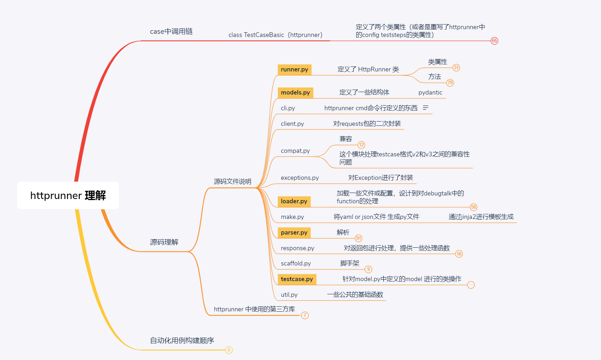

# **HttpRunner_Pro**

本项目是基于HttpRunner进行了**功能扩展改造**，在原有功能上添加了接口测试时的数据库操作，如：数据库初始化、数据库数据校验等步骤。

### 框架特点

* 扩展功能是可插拔式。在不使用扩展功能时，该框架与原有框架行为保持一致。
* 扩展功能使用语法，兼顾或复用原有框架的写法

| 数据库        | 是否支持 |
| ------------- | -------- |
| mysql         | **已支持** |
| mongo         | **已支持** |
| redis         | **已支持** |
| elasticsearch | 待支持   |

### 本文大纲

* [背景-为什么要做/改造httprunner框架](##一.背景（可跳过）)
* [使用说明](##二.使用说明)
  * [使用前提](##1·使用前提)
  * [安装](##2·安装)
  * [关键字说明](##3·关键字说明)
  * [数据库配置](###3.1 数据库配置)
  * [Config](###3.2 Config)
  * [DBDeal](###3.3 DBDeal)
  * [DBValidate](###3.4 DBValidate)
* [如何改造该框架\或如何改造httprunner框架](##三.如何改造该框架)


## 一.背景（可跳过）

### 为什么要做/改造httprunner框架？

* 关键字框架降低了自动化的门槛，执行人员可无编程\低编程进行自动化的实现。
* 多人协同写py自动化时，因每个人的编程能力、规范意识等不同，在有开发规范的前提下，仍会出现各式各样的py自动化脚本，脚本虽可用，但不统一、可维护性差。关键字框架可限制写法，让py脚本具有统一格式、可维护性会有所提高。

## 二.使用说明

## 1·使用前提

如您未使用或了解过httprunner，建议自行学习httprunner。

官方文档： [httprunner V3.x 英文文档](https://docs.httprunner.org/)

中文文档：[httprunner V3.x 中文翻译文档](https://ontheway-cool.gitee.io/httprunner3doc_cn/)

我对httprunner的梳理可见[httprunner调用流程.xmind](https://github.com/zhaochencheng/httprunner_pro/tree/master/docs/)



## 2·安装

使用pip install httprunner_pro

待上传至pip仓库


## 3·关键字说明

**先看示例：**

py写法：

```python
from httprunner import HttpRunner, Config, Step, RunRequest, RunTestCase


class TestCaseRequestWithFunctions(HttpRunner):
    config = (
        Config("request methods testcase with functions")
        .variables(
            **{
                "foo1": "config_bar1",
                "foo2": "config_bar2",
                "expect_foo1": "config_bar1",
                "expect_foo2": "config_bar2",
            }
        )
        .base_url("https://postman-echo.com")
        .verify(False)
        .export(*["foo3"])
        # 扩展了mysql的数据库配置
        .mysql(**{"host": "localhost", "port": 3306, "user": "root", "password": "root","database": "blog", "connect_timeout": 20})
    )

    teststeps = [
        Step(
            # 扩展了数据库的初始化操作
            DBDeal()
            .mysql()
            .with_variables(**{"name": "name", "state": 1, "create": "${get_loginid(created_by)}"})
            .exec('''INSERT INTO `blog_tag` (`name`, `created_on`, `created_by`, `modified_on`, `modified_by`, `deleted_on`, `state`) VALUES ( 'Golang', '1639404686', 'admin', '0', '', '0', '1');''')
            .extract()
            .with_jmespath("tags.list1[0].name", "tag_name"),
            
            
            RunRequest("get with params")
            .with_variables(
                **{"foo1": "bar11", "foo2": "bar21", "sum_v": "${sum_two(1, 2)}"}
            )
            .get("/get")
            .with_params(**{"foo1": "$foo1", "foo2": "$foo2", "sum_v": "$sum_v"})
            .with_headers(**{"User-Agent": "HttpRunner/${get_httprunner_version()}"})
            .extract()
            .with_jmespath("body.args.foo2", "foo3")
            .validate()
            .assert_equal("status_code", 200)
            .assert_equal("body.args.foo1", "bar11")
            .assert_equal("body.args.sum_v", "3")
            .assert_equal("body.args.foo2", "bar21"),
            
            # 扩展了数据库 数据校验
            DBValidate()
            .mysql()
            .with_variables(**{"name": "name", "state": 1, "create": "${get_loginid(created_by)}"})
            .exec('''(select {},{},{} from blog_tag;).format($name, ${get_loginid(state)}, $create)''',"tags")
            .extract()
            .with_jmespath("tags.list1[0].name", "valtag_name")
            .validate()
            .assert_equal('valtag_name', 'cc222'),
        )
    ]


if __name__ == "__main__":
    TestCaseRequestWithFunctions().test_start()
```

yaml文件写法：

```yaml
config:
    name: basic test with httpbin
    base_url: ${get_mock_url()}
    variables: {"address": "hefei", "mockurl": "${get_mock_url()}", "sql": "select * from table where name = 'bob'", "mysql_env": "${ENV(mysql_host)}", "connect_timeout": 20}
    verify: true
    export: ["name"]
    weight: 1
    mysql: {"host": "172.31.114.19", "port": 3306, "user": "root", "password": "root", "database": "blog"}

teststeps:
-
# 新增dbDeal 数据库数据初始化
    dbDeal:
        - mysql:
              conf: {"host": "172.31.114.19", "port": 3306, "user": "root", "password": "root", "database": "blog"}
              variables:
                  {"name": "name", "state": 1, "create": "${get_loginid(created_by)}"}
              exec:
                  sql: "INSERT INTO `blog_tag` (`name`, `created_on`, `created_by`, `modified_on`, `modified_by`, `deleted_on`, `state`) VALUES ( 'Golang', '1639404686', 'admin', '0', '', '0', '1');"
                  alias: tags
              extract:
                  tag_name: tags.list1[0].name
        - mysql:
              exec:
                  sql: 'UPDATE `blog`.`blog_tag` SET `id`="70", `name`="PHP", `created_on`="1639404686", `created_by`="admin", `modified_on`="0", `modified_by`="", `deleted_on`="0", `state`="1" WHERE (`id`="70");'

# httprunner 原有request写法
    name: headers
    request:
        url: /v1/tags
        method: GET
    validate:
        - eq: ["status_code", 200]
        - eq: [body.code, "000000"]

# 新增dbValidate 数据库数据校验
    dbValidate:
        - mysql:
              conf: {}
              exec:
                  sql: (select {},{},{} from blog_tag;).format($name, ${get_loginid(state)}, $create)
                  alias: tags
              extract:
                  tag_name: tags.list1[0].name
              validate:
                  - eq: ["tag_name", "cczhao2"]
        - mysql:
              variables: {"name": "name", "state": 1, "create": "${get_loginid(created_by)}"}
              exec:
                  sql: (select {},{},{} from blog_tag;).format($name, ${get_loginid(state)}, $create)
                  alias: tags
              extract:
                  tag_name: tags.list1[0].name
              validate:
                  - eq: ["tag_name", "cczhao2"]
```


**简要说明：**

在HttpRunner.Step的参数中进行了扩展，由原生的只支持传RunRequest实例，现横向扩展多个参数。在参数写法上不关注先后顺序

建议以DBDeal -> DBDeal ... -> RunRequest - > DBValidate -> DBValidate ... 这样的写法顺序，便于用例阅读和逻辑理解。

### 3.1 数据库配置

数据库配置可在3个地方进行配置

* Config()中添加；

	​	具体配置参数见[3.2 Config](###3.2 Config)

	​	eg：Config().mysql()

* Step中数据库操作 DBDeal()和DBValidate()中添加；

	​	具体配置参数见 [3.3 DBDeal](###3.3 DBDeal) [3.4 DBValidate](###3.4 DBValidate)

	​	eg：DBDeal().mysql()、DBValidate().mysql()

* .env file中进行配置; 

	​	 eg：hrun_mysql_host=localhost

	注意：.env中进行配置时 通过前缀+参数 构成对数据库的配置，

	前缀统一格式："hrun_" + "数据库描述"+ "_host"

	eg：

	> mysql的配置前缀为：hrun_mysql_

	> mongo的配置前缀为：hrun_mongo_

	> redis单机的配置前缀为：hrun_redis_signle_

	> rediscluster集群的配置前缀为：hrun_redis_cluster_
	
	> redis哨兵集群的配置前缀为：hrun_redis_sentinel_
	
	

**优先级：**

Step中的数据库操作 DBDeal()和DBValidate()  > Config() > .env

即：

​		如Step中的DBDeal()和DBValidate()未申明，则使用Config()中的配置，

​		如Config()未申明，则使用.env中的配置

**不同数据库依赖库：**

mysql：使用PyMySQL==1.0.2，可参考[PyMySQL_GitHub](https://github.com/PyMySQL/PyMySQL)进行安装与使用

mongo：使用PyMySQL==1.0.2，可参考[pymongo_GitHub](https://github.com/mongodb/mongo-python-driver)进行安装与使用

redis：使用redis-py-cluster==2.1.3，可参考[redis-py-cluster_GitHub](https://github.com/Grokzen/redis-py-cluster)进行安装与使用

ElasticSearch：

### 3.2 Config

支持httprunner原有Config中的所有参数

新增参数如下：

#### mysql (optional)

对mysql进行配置，包含mysql的host、port、user、password、database等。具体mysql的参数可见PyMySQL

的配置参数

eg：

```python
.mysql(**{"host": "127.0.0.1", "port": 3306, "user": "root", "password": "root",
          "database": "blog", "connect_timeout": 10})
```

同时参数支持httprunner的上下文参数

eg:

```python
Config("demo")
.base_url("http://127.0.0.1:8000")
.variables(**{"mysql_env": "${ENV(mysql_host)}", "connect_timeout": 20})
.mysql(**{"host": "$mysql_env", "port": "3306", "user": "root", "password": "root",
          "database": "blog", "connect_timeout": "$connect_timeout"})
```


#### mongo(optional)

对mongo进行配置，包含mongo的host、port、password、database等。具体mongo的参数可见pymongo

的配置参数

eg：

```python
.mongo(**{"host": "172.31.114.54", "port": 37017, "user": "", "password": "",
          "database": "caccount_test"}) 
```


#### redis_signle(optional)

 对redis单点进行配置，包含redis的host、port、password、database等。具体redis的参数可见StrictRedis的配置参数

```python
.redis_signle(**{"host": "172.31.114.54", "port": 6379, "database": 0})
```


#### redis_cluster(optional)

 对redis cluster集群进行配置，包含cluster集群的host、port、password等。具体cluster的参数可见RedisCluster的配置参数。

两种配置方式：

* 集群中的某个点的host+port，即可连接cluster集群

```python
.redis_cluster(**{"host": "172.31.114.19", "port": 8101})
```

* 集群中的完整node节点

```python
.redis_cluster(**{"startup_nodes": [{"host": "172.31.114.19", "port": 8101}, {"host": "172.31.114.19", "port": 7101},{"host": "172.31.114.19", "port": 6101}]})
```


#### redis_sentinel(optional)

 对redis 哨兵集群进行配置，包含哨兵集群的host、port、password、database、servicename等。具体哨兵的参数可见Sentinel的配置参数。

两种配置方式：

* 集群中单个节点

```python
.redis_sentinel(**{"host": "172.31.114.82", "port": 16401, "servicename": "mymaster", "database": 0})
```

* 集群中完整哨兵节点

```python
.redis_sentinel(**{"sentinels": [('172.31.114.82', 16401), ('172.31.114.82', 16402), ('172.31.114.82', 16403)],"servicename": "mymaster", "database": 0})
```


#### elasticsearch(optional)

 待补充

### 3.3 DBDeal

数据库配置中，因使用的数据库种类不同，故定义的关键字会有所不同。

eg:

```python
DBDeal().mysql()
DBDeal().mongo()
DBDeal().redis_signle()
DBDeal().redis_cluster()
DBDeal().redis_sentinel()
```


#### mysql 数据处理

##### mysql(optional)

参数与Config.mysql()中参数一致。在此配置仅影响当前DBDeal的数据执行

##### with_variables(optional)

指定测试用例的公共变量。每个测试步骤都可以引用未在步骤变量中设置的配置变量。换句话说，步骤变量比配置变量具有更高的优先级。

##### exec(content, alias)

执行mysql语句，支持对执行语句的结果赋值到变量中，供上下文使用

* **content（required）:** 需要执行的sql语句

* **alias（optional）:** content执行后的结果赋值给该参数。该参数的值为{"list1": Union[List, Dict, Text, Any]}

```python
.exec('''INSERT INTO `blog_tag` (`name`, `created_on`, `created_by`, `modified_on`, `modified_by`, `deleted_on`, `state`) VALUES ( 'Golang2', '1639404686', 'admin', '0', '', '0', '1');''')
```

**特别说明：**

content中sql语句想通过上下文参数传递，需要使用如下写法

```python
.exec('''(select {},{},{} from blog_tag;).format($name, ${get_loginid(state)}, $create)''', "tags")
```

使用().format()构建sql，format前的()中写入sql语句，需要参数的位置通过{}进行占位。format后的()写入上下文参数。即通过$引用的参数，如非上下文参数，则无法对sql中的参数进行赋值。

##### extract

###### .WITH_JMESPATH

使用 jmespath 提取 JSON 响应正文。

* with_jmespath（jmes_path：Text，var_name：Text）

* jmes_path：jmespath 表达式，更多细节参考 JMESPath 教程

* var_name：存储提取值的变量名，可供后续测试步骤引用

```python
.extract()
.with_jmespath("tags.list1[0].name", "tag_name"),
```

**注意：** 通过jmespath 提取的var_name可供后续的RunRequest和DBValidate进行上下文参数使用


#### mongo 数据处理

##### mongo(optional)

参数与Config.mongo()中参数一致。在此配置仅影响当前DBDeal的数据执行

**其他参数同上**

eg：

```python
DBDeal()
    .mongo()
    .exec('''db.getCollection('tb_user_account').insert({"name" : "bob"})'''),
```

**特殊说明：**

##### exec(content, alias)

执行mongo shell语句，支持对执行语句的结果赋值到变量中，供上下文使用

对mongo shell写法支持如下两种写法：

> db.getCollection('tb_user_account').insert()
>
> db.tb_user_account.insert()


#### redis_signle 数据处理

##### redis_signle(optional)

参数与Config.redis_signle()中参数一致。在此配置仅影响当前DBDeal的数据执行

**其他参数同上**

eg：

```python
DBDeal()
    .redis_signle()
    .exec("SET username bob")
```


#### redis_cluster 数据处理

##### redis_cluster (optional)

参数与Config.redis_cluster ()中参数一致。在此配置仅影响当前DBDeal的数据执行

**其他参数同上**

eg：

```python
DBDeal()
    .redis_cluster()
    .exec("SET username maaaaa")
```


#### redis_sentinel 数据处理

redis_sentinel (optional)

参数与Config.redis_sentinel ()中参数一致。在此配置仅影响当前DBDeal的数据执行

**其他参数同上**

eg：

```python
DBDeal()
    .redis_sentinel()
    .exec("set username maaaaa")
```


#### elasticsearch 数据处理

待补充


### 3.4 DBValidate

#### mysql 数据校验

##### mysql(optional)

##### with_variables(optional)

##### exec(content, alias)

##### extract

上述参数的使用与DBDeal保持一致

**新增**

##### validate

###### assert_XXX()

```python
assert_XXX(jmes_path: Text, expected_value: Any, message: Text = "")
```

使用 jmespath 提取 JSON 响应正文并使用预期值进行验证

* jmes_path：jmespath 表达式，更多细节参考 JMESPath 教程

* 预期值：这里也可以使用指定的预期值、变量或函数引用

* 描述（可选）：用于指示断言错误原因

该逻辑与httprunner中RunRequest().validate()逻辑保持一致


##### mongo(optional)

**写法同上**

eg：

```python
DBValidate()
    .mongo()
    .exec('''db.getCollection('tb_user_account').find().limit(1)''', "user_account")
    .extract()
    .with_jmespath("user_account.list1[0].name", "name")
    .validate()
    .assert_equal("name", "bob")
```

##### redis_signle(optional)

**写法同上**

eg：

```python
DBValidate()
    .redis_signle()
    .exec("get name", "name")
    .validate()
    .assert_equal("name.list1", "maaaaa"),
```

##### redis_cluster(optional)

**写法同上**

eg：

```python
DBValidate()
    .redis_cluster()
    .exec("get name", "name")
    .validate()
    .assert_equal("name.list1", "maaaaa"),
```

##### redis_sentinel(optional)

**写法同上**

eg：

```python
DBValidate()
    .redis_sentinel()
    .exec("get name", "name")
    .validate()
    .assert_equal("name.list1", "maaaaa"),
```


## 三.如何改造该框架


